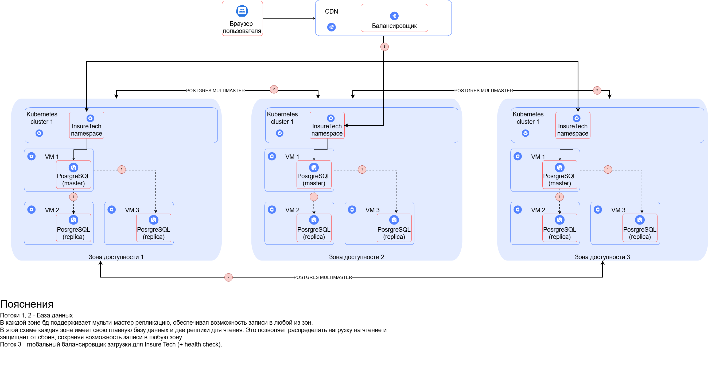

# Задание 1

## [Схема](./t1.drawio)

Эта архитектура обеспечит стабильную работу сервиса 24/7, позволит равномерно обслуживать пользователей из всех часовых поясов и обеспечит требуемую доступность и отказоустойчивость.

## 1. Развертывание приложения

- Мультизональная архитектура:
    - Развертывание в нескольких зонах доступности внутри РФ для обеспечения низкой задержки и высокой доступности.
    - Использование независимых Kubernetes кластеров в каждой зоне для локальной отказоустойчивости и оптимизации расходов.

### 2. Балансировка нагрузки

- Глобальный балансировщик нагрузки:
    - Используется для распределения трафика между кластерами в разных зонах.
    - CDN для кэширования и доставки статики, что обеспечит одинаковое время загрузки страниц для всех пользователей.
    - Active-active failover: Позволяет всем зонам обрабатывать запросы одновременно. Если одна зона выходит из строя, балансировщик автоматически перенаправляет трафик к оставшимся доступным зонам, минимизируя простои и обеспечивая непрерывность обслуживания.

### 3. Конфигурация базы данных

- Репликация и отказоустойчивость:
    - Настройка Postgres с multi-master репликацией на зоны, в самой зоне дополнительно 2 реплики.
    - Распределение операций чтения/записи как внутри зон, так и между ними 
  (если бы использовали мастер и standby одна бы зона стала узким местом)
    - Использование автоматического failover для достижения RTO 45 мин. и RPO 15 мин.
    - Регулярные резервные копии с использованием pgBackRest или аналогов.

### 4. Масштабирование и производительность

- Горизонтальное масштабирование:
    - Добавление новых подов в Kubernetes для обработки повышенной нагрузки.
    - Автоматическое масштабирование на основе метрик нагрузки.

### 5. Отказоустойчивость и доступность

- Достижение 99,9% доступности:
    - Благодаря мультизональному развертыванию и использованию CDN.
   