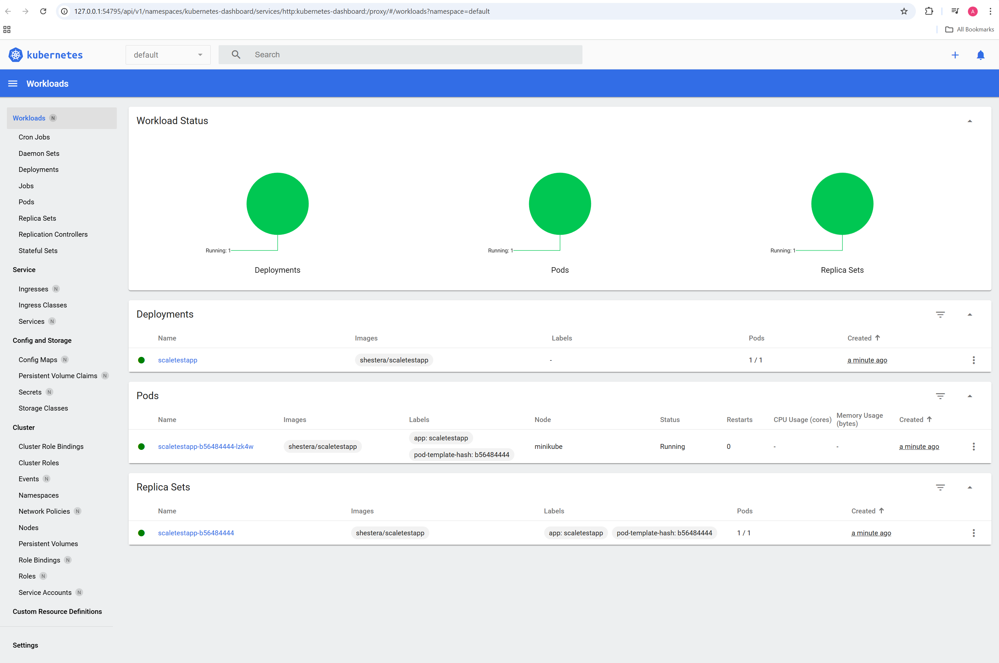
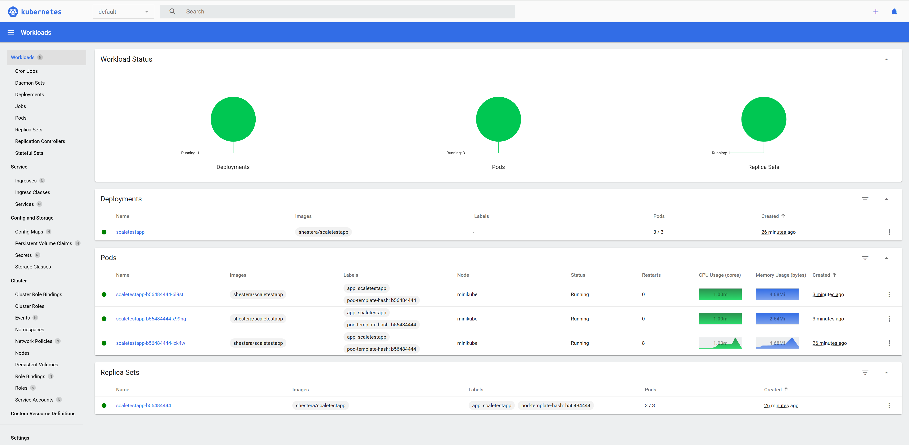

# Задание 2


[deployment.yaml](deployment.yaml)

[hpa.yaml](hpa.yaml)

[service.yaml](service.yaml)


До запуска нагрузочного теста



Во время запуска



Команды, которые использовал

```sh
    # minikube cmd 
    minikube start
    minikube stop
    minikube delete
    
    # metrics-server 
    minikube addons enable metrics-server

  
    # deploy
    kubectl apply -f deployment.yaml
    kubectl apply -f service.yaml
    kubectl apply -f hpa.yaml
    
    # check
    kubectl get nodes
    kubectl get pods -n kube-system
    kubectl top nodes
    kubectl top pods
    kubectl get pods
    kubectl logs <pod-name>
    kubectl get pods -l app=test-app   
    # для прокидываю порт для locust
    kubectl port-forward <pod-name> 8080:8080
   

```

```shell
python -m venv venv
.\venv\Scripts\activate
pip install locust

locust
```