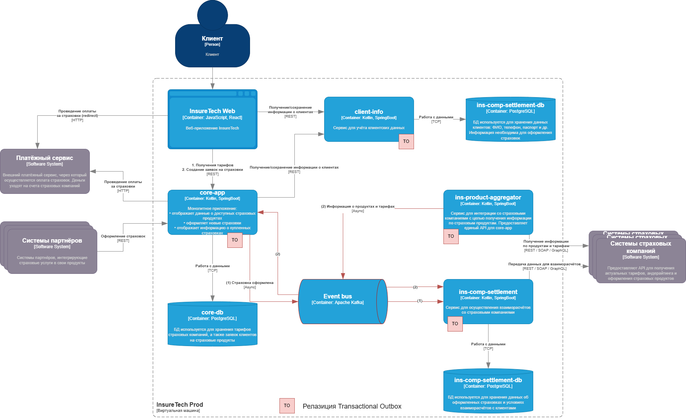

# Задание 3

[Схема С4](t1.drawio.xml)

## Проблемы и риски

1. Задержки и тайм-ауты:
    - Увеличение числа страховых компаний может привести к увеличению задержек, что вызовет тайм-ауты при синхронных API-вызовах.

2. Проблемы с масштабируемостью:
    - С увеличением числа компаний нагрузка на ins-product-aggregator возрастет, что может вызвать узкие места в производительности.

3. Несогласованность данных:
    - Различие в частоте обновления данных (15 минут против одного раза в сутки) может привести к несоответствиям между core-app и ins-comp-settlement.

4. Обработка ошибок:
    - Увеличение взаимодействий с внешними API может привести к более частым ошибкам, требующим надежной обработки и повторных попыток.

5. Зависимость от синхронных вызовов:
    - Текущая архитектура сильно полагается на синхронную коммуникацию, что менее устойчиво к сбоям и задержкам.

## Предлагаемые решения

1. Изменить способ взаимодействия на асинхронный между сервисами core-app и ins-comp-settlement. 
После оформления каждой страховки можно отправлять событие на взаиморасчёты. 
В этом же месте стоит применить Transactional Outbox для того, 
чтобы данные были полностью консистентны взаиморасчеты были произведены в полном объеме
2. Изменить способ взаимодействия на асинхронный с сервисом ins-product-aggregator. 
Потребители данных будут получать обновления о тарифах определенных компаний по мере их актуализации в агрегаторе.